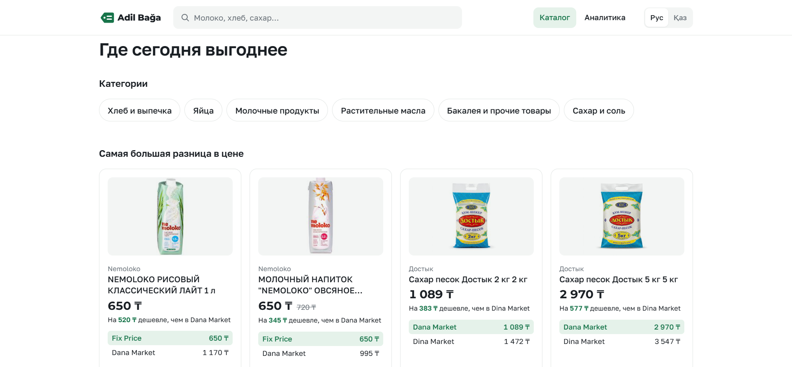
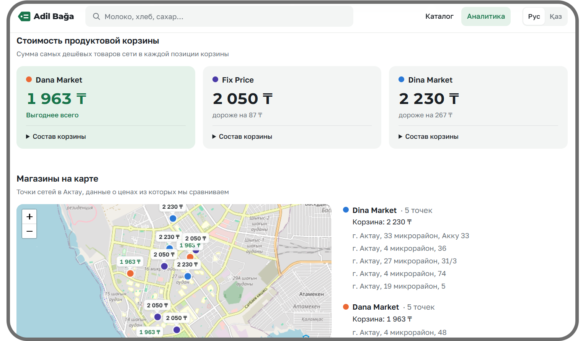

<p align="center">
  
</p>

<h1 align="center">Adil Bağa — Әділ баға</h1>

<p align="center">
  <strong>Сервис для жителей Актау, который сравнивает цены на продукты, показывает городскую аналитику и помогает найти самое выгодное предложение через web и Siri.</strong>
</p>

<p align="center">
  <a href="https://drive.google.com/file/d/1-tAK564vpBrJkKRu9fofxACQNTRgFW72/view?usp=sharing">
    
  </a>
  <a href="https://adil-baga.vercel.app/">
    
  </a>
  <a href="docs/">
    
  </a>
</p>

<p align="center">
  
  
  
  
</p>

---

## Что такое Adil Bağa? 🏷️

**Adil Bağa (Әділ баға, «Справедливая цена»)** — веб-сервис мониторинга и сравнения цен на социально значимые и повседневные продукты в Актау.

Проект объединяет данные магазинов в единый каталог и помогает быстро получить ответ на простой вопрос:

> **Где нужный товар сегодня дешевле и где находится ближайшая точка этого магазина?**

В MVP используются данные трёх торговых сетей:

- **Dana Market**;
- **Dina Market**;
- **Fix Price**.

Во время работы приложения backend **не обращается к сайтам магазинов**. Каталоги были собраны заранее, нормализованы и сохранены как snapshot в PostgreSQL.

---

## Проблема 🔍

Цена одного и того же продукта может отличаться от магазина к магазину, но сравнивать её неудобно:

- нужно открывать несколько каталогов;
- одинаковые товары могут называться по-разному;
- цены приходится сопоставлять вручную;
- после сравнения ещё нужно искать ближайшую точку выбранной сети;
- для городского мониторинга нет единой картины ценового разброса.

В результате более выгодное предложение может находиться в нескольких минутах от человека, но он о нём не знает.

---

## Решение ✅

Adil Bağa сокращает путь от поиска до конкретного решения:

```text
Нужный товар
      ↓
Единый каталог
      ↓
Сравнение предложений
      ↓
Минимальная цена
      ↓
Магазин
      ↓
Ближайшая точка
```

Пользователь получает уже подготовленный результат — frontend не агрегирует цены самостоятельно.

---

## Основные возможности ✨

- 🛒 **Единый каталог** — товары Dana Market, Dina Market и Fix Price в одном интерфейсе;
- 💸 **Сравнение цен** — минимальная цена показывается первой, остальные предложения идут ниже;
- 🔎 **Поиск и динамические фильтры** — фильтры зависят от реальных характеристик категории;
- 📊 **Городская аналитика** — ценовой разброс и сравнение фиксированной продуктовой корзины;
- 🗺 **Карта магазинов** — физические точки сетей в Актау;
- 📍 **Ближайший магазин** — расстояние рассчитывается по геолокации пользователя;
- 🎙 **Интеграция с Siri** — голосовой запрос возвращает товар, цену, сеть, адрес и изображение;
- 🤖 **Gemini только для NLP** — AI извлекает intent и фильтры, но не выбирает самый дешёвый товар;
- 🧯 **Fallback для voice-flow** — при недоступности внешнего AI demo-сценарий не должен ломаться.

---

## Скриншоты

### Каталог

<p align="center">
  
</p>

### Аналитика

<p align="center">
  
</p>

### Siri

<p align="center">
  
</p>

---

## Что уже работает? ✅

- единый snapshot данных магазинов Актау;
- **849** canonical products;
- **3** торговые сети;
- **15** физических точек на карте;
- **6** публичных категорий;
- поиск, фильтрация и сортировка;
- карточка товара с предложениями разных сетей;
- dashboard с ценовым разбросом;
- фиксированная продуктовая корзина по сетям;
- карта магазинов;
- поиск ближайшей точки по Haversine distance;
- voice API;
- clarification-flow для неполного голосового запроса;
- Gemini structured NLP;
- три Gemini API key с failover;
- Upstash Redis для коротких voice sessions;
- rich notification Siri с изображением товара;
- публичный frontend и backend;
- unit, integration и Playwright E2E проверки.

---

## Как устроен проект? 🧩

### Подготовка данных

```text
Dana Market / Dina Market / Fix Price
                ↓
         одноразовый import
                ↓
      deterministic normalization
                ↓
        product matching
                ↓
         canonical snapshot
                ↓
        PostgreSQL / Supabase
```

### Runtime

```text
React + Vite
     ↓ REST
  NestJS API
     ↓
PostgreSQL
```

### Voice flow

```text
Siri
 ↓
POST /api/voice/start
 ↓
Gemini: текст → intent + filters
 ↓
NestJS / PostgreSQL: поиск и сравнение цен
 ↓
Nearest Store / Haversine
 ↓
готовый structured result
 ↓
Siri speech + notification
```

> **Важно:** Gemini не сравнивает цены, не выбирает магазин и не определяет самый дешёвый товар. Эти решения выполняются детерминированно в NestJS/PostgreSQL.

---

## Технологии 🛠️

| Слой | Технологии |
|---|---|
| Frontend | React 19, Vite 8, TypeScript |
| UI / routing | Tailwind CSS, React Router |
| Data fetching | TanStack Query |
| Карта | Leaflet / React Leaflet |
| Backend | NestJS 11, TypeScript |
| Database | PostgreSQL / Supabase |
| ORM | Prisma |
| Voice NLP | Gemini API |
| Voice sessions | Upstash Redis |
| Geolocation | Haversine distance |
| Tests | Node Test Runner, Vitest, Playwright |
| Frontend deploy | Vercel |
| Backend deploy | Railway |

---

## API

Основные публичные endpoints:

```text
GET  /api/categories
GET  /api/categories/:slug/filters
GET  /api/products
GET  /api/products/:id
GET  /api/dashboard
POST /api/voice/start
POST /api/voice/continue
```

`GET /api/products` поддерживает:

- category;
- search;
- sort;
- pagination;
- dynamic filters.

По умолчанию товары сортируются по минимальной цене.

---

## Быстрый запуск 🚀

### Требования

- Git;
- Node.js 24;
- pnpm 10;
- PostgreSQL / Supabase.

### 1. Клонирование

```bash
git clone https://github.com/kiratonine/AdilBaga.git
cd AdilBaga
```

### 2. Backend

```bash
cd backend
pnpm install
cp .env.example .env
```

Заполните `backend/.env`:

```env
DATABASE_URL=
DIRECT_URL=

GEMINI_API_KEY=
GEMINI_API_KEY2=
GEMINI_API_KEY3=
GEMINI_MODEL=gemini-3.1-flash-lite

UPSTASH_REDIS_REST_URL=
UPSTASH_REDIS_REST_TOKEN=
```

Подготовьте Prisma client и соберите backend:

```bash
pnpm db:generate
pnpm build
```

Запуск:

```bash
node --env-file=.env dist/src/main.js
```

Backend по умолчанию доступен на:

```text
http://localhost:3000
```

### 3. Frontend

В новом терминале:

```bash
cd frontend
pnpm install
cp .env.example .env
```

Для работы с локальным backend:

```env
VITE_API_MODE=http
VITE_API_BASE_URL=http://localhost:3000
```

Запуск:

```bash
pnpm dev
```

Frontend:

```text
http://localhost:5173
```

---

## База данных 🗄️

Для runtime используется PostgreSQL snapshot.

Если поднимается новая локальная база:

```bash
cd backend

pnpm db:generate
pnpm exec prisma migrate deploy
pnpm db:seed
pnpm db:verify
```

> Для обычного runtime и live demo повторный парсинг сайтов магазинов не требуется.

---

## Проверка проекта 🧪

### Backend

```bash
cd backend

pnpm build
pnpm test
pnpm test:matching
pnpm test:audit
```

### Frontend

```bash
cd frontend

pnpm typecheck
pnpm lint
VITE_API_MODE=mock pnpm test
pnpm build
```

### Real HTTP E2E

При запущенном backend:

```bash
cd frontend

E2E_API=http \
VITE_API_BASE_URL=http://127.0.0.1:3000 \
PW_CHANNEL=chrome \
pnpm test:e2e
```

Siri-flow дополнительно проверяется вручную на реальном iPhone.

---

## Структура репозитория 📁

```text
AdilBaga/
├── assets/
│   ├── logo/
│   │   └── Logo.jpg
│   └── screenshots/
│       ├── catalog.png
│       ├── analytics.png
│       └── siri.png
│
├── backend/
│   ├── prisma/                 # Prisma schema, migration, seed
│   ├── scripts/                # audit / verification utilities
│   └── src/
│       ├── database/           # PostgreSQL adapters
│       ├── modules/            # import / normalization / matching
│       └── voice/              # Gemini, sessions, voice flow
│
├── data/
│   └── snapshots/              # frozen dataset used by the MVP
│
├── docs/                       # техническая документация и reports
│
├── frontend/
│   ├── public/
│   └── src/
│       ├── api/
│       ├── components/
│       ├── pages/
│       └── mocks/
│
├── scripts/
└── README.md
```

---

## Roadmap 🛣️

### Уже готово

- [x] сравнение цен в Актау;
- [x] единый canonical catalog;
- [x] поиск и динамические фильтры;
- [x] dashboard и карта;
- [x] фиксированная продуктовая корзина;
- [x] ближайшая точка магазина;
- [x] интеграция с Siri;
- [x] Gemini NLP + deterministic fallback;
- [x] публичный frontend и backend;
- [x] end-to-end demo flow.

### Следующие шаги

- [ ] подключить больше магазинов и торговых сетей Актау;
- [ ] расширить количество категорий и товаров;
- [ ] автоматизировать регулярное обновление snapshot;
- [ ] усилить автоматический контроль качества данных;
- [ ] добавить голосовые сценарии для Gemini на Android;
- [ ] исследовать Samsung Bixby и Xiaomi / HyperOS voice integrations;
- [ ] добавить историю изменения цен;
- [ ] показывать динамику стоимости продуктовой корзины;
- [ ] добавить уведомления о заметных изменениях цен;
- [ ] расширить городской аналитический dashboard.

---

## Документация 📚

- [Техническое задание MVP](docs/00_TECHNICAL_SPEC.md)
- [Риски и технические решения](docs/01_RISKS_AND_DECISIONS.md)
- [Вся документация проекта](docs/)

---

<p align="center">
  <strong>Adil Bağa — справедливая цена за один запрос.</strong>
</p>
